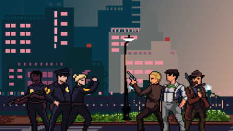

# MAFIA CITY
|  | Polytech Dijon - 4A - ILIA   &nbsp;&nbsp;&nbsp;&nbsp;&nbsp;&nbsp;&nbsp;4th&nbsp;&nbsp;Year&nbsp;&nbsp;Project&nbsp;&nbsp;&nbsp;&nbsp;&nbsp;&nbsp;&nbsp;   **[ MAFIA CITY ]**  |  |
|:--------------------------------------------------------|:---------------------------------------------------------------------------------------------------------------------------------------------------------------------------------------:|----------------------------------------------------------------------:|

## Table of Contents
- [Description](#description)
- [Game Design Document](#game-design-document)
- [Gameplay](#gameplay)
- [Features](#features)
- [Download](#download)
- [Controls](#controls)
- [Contributors](#contributors)

## Description
**Mafia City** is a 2D action game set in the roaring twenties in London. Choose to play as a **Mafia enforcer** protecting your business or a **Police officer** trying to bring down organized crime. Fight through dangerous streets, defeat your enemies, and shape the fate of the city.

Developed with **Godot Engine**, this game offers **fast-paced combat** and **multiple characters**. Each character has unique abilities and weapons, allowing you to play the game in different ways.

## Game Design Document
You can find the full Game Design here:  
📄 [Game Design Document (PDF)](./Gamedev_design_document_mafiacity.pdf)

## Gameplay
- **Side-scrolling combat**: Engage in melee and ranged fights against gangsters and law enforcement.
- **Multiple playable characters**: Each with unique weapons and abilities.
- **Tactical decision-making**: Attack, dodge, or outmaneuver opponents in an intense street battle.
- **Challenging levels**: Face increasing difficulties with stronger enemies.

## Features
✅ **2D pixel art style** set in the 1920s   
✅ **Dynamic combat system** with melee & ranged attacks   
✅ **Different characters** with unique weapons  
✅ **Challenging enemy** requiring strategic play  
✅ **Immersive soundtrack**

## Download
Supports Windows, Linux and macOS.
You can download the game here [Download](https://github.com/Noureddine-t/Projet_4A/releases/tag/v1.2.0-official)

## Controls

| Action      | Keyboard | Gamepad |
|------------|---------|---------|
| Move       | Arrow Keys | D-Pad / Joystick |
| Run        | Double tap direction key | Double tap joystick |
| Attack (Melee) | `A` | Square (PS) / X (Xbox) |
| Shoot (Ranged) | `F` | Circle (PS) / B (Xbox) |
| Pause Menu | `Esc` | Start / Menu |
| Navigate Menu | Arrows / Enter | Joystick / A (Xbox) |
> [!NOTE]
> You can also use the mouse to navigate the menu and click on buttons.
## Contributors

- Nour eddine TALEB [GitHub](https://github.com/Noureddine-t)
- Hatim BAHAND [GitHub](https://github.com/hatimbd)
- Quentin DAVIN [GitHub](https://github.com/itsax404)

🔥 *Get ready to rule the streets or restore order in Mafia City!* 🚔💰

[]

[🔼 Back to Top](#mafia-city)